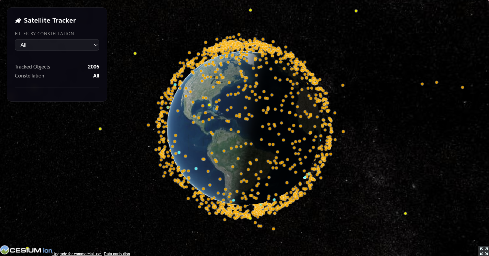
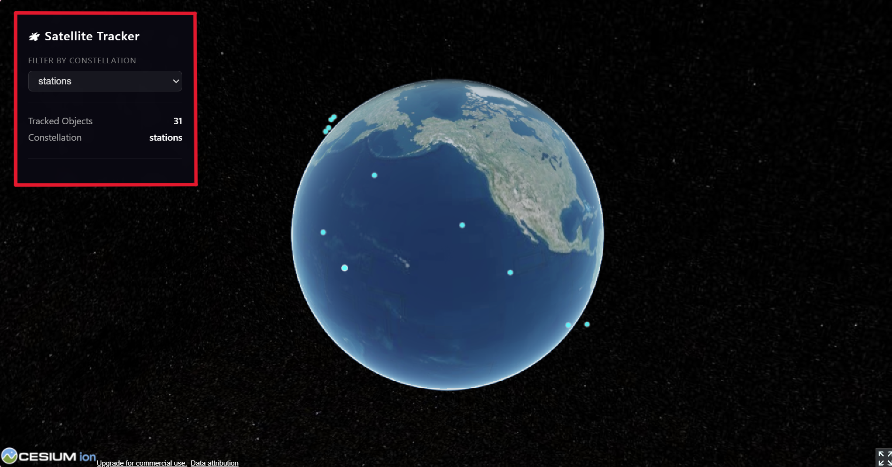
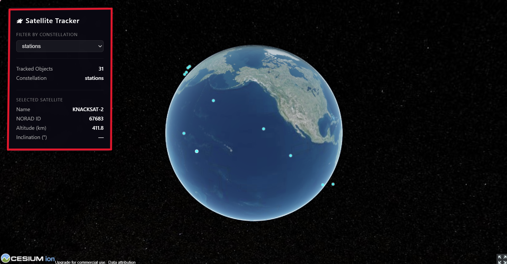

# Satellite Constellation Tracker

A real-time satellite tracking dashboard powered by MongoDB Atlas. TLE orbital data is ingested from CelesTrak, stored in MongoDB, and rendered as smoothly moving satellites on an interactive 3D globe.

---

## Screenshots





---

## Overview

This project demonstrates the strengths of NoSQL databases in a real-world, high-volume data pipeline. TLE (Two-Line Element) orbital data is inherently schema-flexible, frequently updated, and high-volume — making it a poor fit for relational models and a natural showcase for MongoDB's document model.

The pipeline ingests live TLE data from [CelesTrak](https://celestrak.org) every 90 minutes, upserts it into MongoDB Atlas, and serves it via a FastAPI backend. The browser fetches TLE documents and runs SGP4 orbital propagation every animation frame via `satellite.js`, driving smooth real-time satellite movement on a CesiumJS 3D globe.

---

## Features

- Live 3D globe with real-time satellite movement at 60fps
- Automatic TLE ingestion every 90 minutes via APScheduler
- Filter satellites by constellation (Space Stations, Starlink, GPS, NOAA)
- Click any satellite to view its name, NORAD ID, altitude, and inclination
- Color-coded constellations for at-a-glance identification
- Historical TLE change tracking with automatic 7-day expiry
- MongoDB aggregation-ready schema for orbital analytics

---

## Tech Stack

| Layer | Technology |
|---|---|
| Database | MongoDB Atlas (free tier) |
| Backend | Python, FastAPI, APScheduler |
| TLE Ingestion | requests, pymongo |
| Frontend | CesiumJS (3D globe), satellite.js (SGP4 propagation) |
| Data Source | CelesTrak GP elements (TLE format) |

---

## Architecture

```
CelesTrak  →  (every 90 min)  →  Python ingestion script
                                        ↓
                               Upserts into MongoDB Atlas
                               (satellites + tle_history)
                                        ↓
                                   FastAPI backend
                                        ↓
                              Serves TLE documents to browser
                                        ↓
                    satellite.js propagates positions every frame
                                        ↓
                        CesiumJS renders satellites on 3D globe
```

### MongoDB Collections

**`satellites`** — one document per satellite, upserted on each ingestion run.

```json
{
  "NORAD_CAT_ID": 25544,
  "OBJECT_NAME": "ISS (ZARYA)",
  "TLE_LINE1": "1 25544U 98067A ...",
  "TLE_LINE2": "2 25544  51.6327 ...",
  "constellation": "stations",
  "ingested_at": "2026-04-16T17:52:37.314Z"
}
```

**`tle_history`** — append-only. A new document is inserted only when the element set has changed since the last ingestion. TTL index expires documents after 7 days.

### Key Architectural Decision: Client-Side Propagation

Satellite positions are **never stored in MongoDB**. Instead, the browser runs SGP4 math via `satellite.js` on every animation frame. This is what enables smooth real-time movement — server-side position computation at ingest time would cause satellites to only "jump" every 90 minutes when new TLEs arrive.

---

## Setup

### Prerequisites

- Python 3.10+
- A [MongoDB Atlas](https://www.mongodb.com/cloud/atlas) account (free tier is sufficient)
- A [Cesium ion](https://ion.cesium.com) account (free tier is sufficient)

### 1. Clone the repository

```bash
git clone https://github.com/yourusername/satellite-tracker.git
cd satellite-tracker
```

### 2. Install dependencies

```bash
pip install -r requirements.txt
```

### 3. Configure environment variables

Create a `.env` file in the project root. This file is excluded from the repository for security — you must create it manually:

```
MONGO_URI=mongodb+srv://<username>:<password>@cluster0.xxxxx.mongodb.net/
DB_NAME=satellite_tracker
```

- `MONGO_URI` — your full Atlas connection string. Found in Atlas under *Connect → Drivers*.
- `DB_NAME` — the name of the database to create inside your cluster. `satellite_tracker` is recommended.

### 4. Configure your Cesium ion token

Open `frontend/js/app.js` and replace the token value:

```js
Cesium.Ion.defaultAccessToken = "your_token_here";
```

Your token is found at [ion.cesium.com](https://ion.cesium.com) under *Access Tokens*.

### 5. Initialize MongoDB indexes

```bash
python db/mongo.py
```

This creates the required indexes on both collections. Safe to run multiple times.

### 6. Run the ingestion scheduler

```bash
python -m ingestion.scheduler
```

This performs an immediate ingest on startup, then repeats every 90 minutes automatically.

### 7. Run the API server

In a separate terminal:

```bash
python -m api.main
```

### 8. Open the dashboard

Navigate to [http://localhost:8000](http://localhost:8000) in your browser.

---

## Usage

- **Rotate** the globe by left-clicking and dragging
- **Zoom** with the scroll wheel or right-click drag
- **Filter** satellites by constellation using the dropdown in the top-left panel
- **Click** any satellite to view its details in the info panel
- Satellites are color-coded by constellation:
  - 🔵 Cyan — Space Stations
  - ⚪ White — Starlink
  - 🟡 Yellow — GPS
  - 🟢 Green — NOAA Weather

---

## Project Structure

```
satellite-tracker/
├── .env                      # not committed — see Setup
├── .gitignore
├── requirements.txt
├── db/
│   └── mongo.py              # Atlas connection and index initialization
├── ingestion/
│   ├── fetch.py              # CelesTrak TLE fetcher and parser
│   ├── ingest.py             # upsert + tle_history logic
│   └── scheduler.py          # APScheduler 90-minute ingest loop
├── api/
│   └── main.py               # FastAPI — serves TLEs and static frontend
└── frontend/
    ├── index.html
    ├── css/
    │   └── style.css
    └── js/
        ├── app.js            # CesiumJS globe + satellite.js propagation
        └── satellite.min.js  # local copy of satellite.js
```
